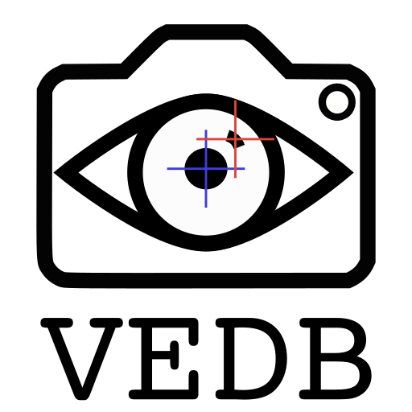

```{r setup, include=FALSE}
knitr::opts_chunk$set(echo = TRUE)
```
<br/>

<div class = "grid2">
<div class = "grid-main">
<center>
# The Visual Experience Database 
</center>
 
<li> A database of video captured from head-mounted cameras combined with recordings of the videographer’s eye movements</li>
<li> Recoded by a diverse set of observers engaged in common, everyday activities such as shopping, eating, or walking.</li>
<li> Bypasses many of the biases of existingin databases by representing common, human experiences</li>
<li> Increases the efficacy of computer vision algorithms.
</div>

<div class = "grid-item1">
<div class="flex-item">
 
The [**Big Data Summer School**](https://maggieds.github.io/VED/summerschool.html) is happening virtually on July 6-10 this year. 
</div>
</div>

<div class = "grid-item2">
<div class="flex-item">
<center> </center>  
Head over to the [**News**](https://maggieds.github.io/VED/news.html) page to find out what's going on in the video below.
<center>
<iframe width=100% src="https://www.youtube.com/embed/iChh6G4mqbc" title="video of participant walking around UNR campus wearing data recording device.  Video has no sound" frameborder="0" allow="accelerometer; autoplay; encrypted-media; gyroscope; picture-in-picture" allowfullscreen></iframe> 
</center>
</div>
</div>

<div class = "grid-sidebar">
<div class="flex-container-sidebar">
<center>
# Get Involved
</center>
<div class="flex-item">
## Help Us Record!
We are seeking participants to record first person video data. See the [**Volunteer to Participate**](https://maggieds.github.io/VED/news.html) section for more information. 
</div>
<br/>
<div class="flex-item">
## Research your own questions!  
The [VEDB data and software](https://maggieds.github.io/VED/researchers.html) are available on an open-access basis after a short embargo period.  We're also happy to collaborate!
</div> 
</div> 
</div>
</div>