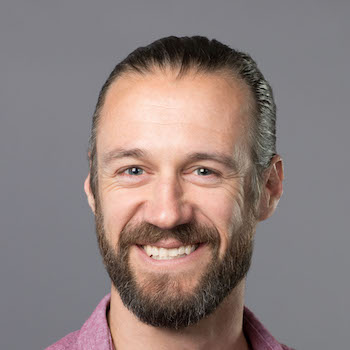
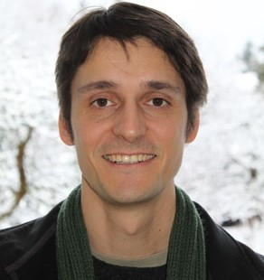
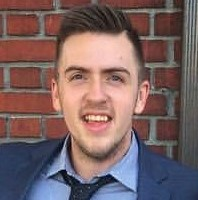
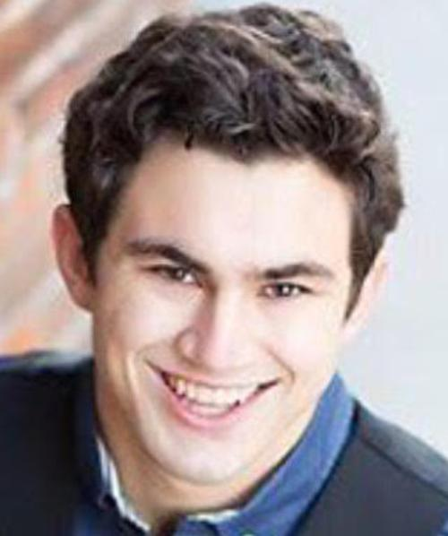

```{r setup, include=FALSE}
knitr::opts_chunk$set(echo = TRUE)
```
<style>
.column-left{
  float: left;
  width: 50%;
  text-align: left;
}
}
.column-right{
  float: right;
  width: 50%;
  text-align: left;
}
</style>


<div class="column-left">
# Michelle Greene, PhD  
Assist. Prof. of Neuroscience  
Bates College  
Lewiston, ME  
Email: mgreene@bates.edu  
**[The Greene Lab](http://michellegreene.org/index.html)**  
</div>
<div class="column-right">

</div>
\
\
<div class="column-left">
# Mark Lescroart, PhD  
Department of Psychology  
University of Nevada, Reno  
Reno, NV  
Email: mlescroart@unr.edu  
**[Pieces of Mind Lab](http://piecesofmind.psyc.unr.edu/)**  

</div>
<div class="column-right">

</div>
\
\
<div class="column-left">
# Paul MacNeilage, PhD  
Department of Psychology  
University of Nevada, Reno  
Reno, NV  
Email: pmacneilage@unr.edu  
**[MacNeilage website](https://www.unr.edu/neuroscience/people/paul-macneilage)**  
\
\
</div>
<div class="column-right">

</div>
\
\

# Benjamin Balas, PhD  
Department of Psychology  
North Dakota State University  
Fargo, ND  
Email: benjamin.balas@ndsu.edu  
**[The Balas Lab](https://sites.google.com/site/benjaminbalas/)**  
\
\

# Postdoctoral Researchers
## Kamran Binaee, PhD
  
University of Nevada, Reno  
kbinaee@unr.edu
\
\

# Graduate Students

<div>
<div class="row">

<div class = "col-md-4">
**Arnab Biswas**    
*image*  
Univ. of Nevada, Reno  
arnab.biswas93@gmail.com 
</div>

<div class = "col-md-4">
**Peter Hausamann**  
*image*  
Institution  
peter.hausamann@tum.de  
</div>

<div class = "col-md-4">
**Matthew Shinkle**  
  
University of Nevada, Reno  
mshinkle@nevada.unr.edu
</div>

<div class = "col-md-4">
**Christian Sinnott**  
  
Univ. of Nevada, Reno  
csinnott@nevada.unr.edu  
</div>
</div>

<br/>
<br/>

# Undergraduate Students
<br/>
<div>
<div class="row">

<div class = "col-md-4">
## Bates College  
<br/>

**Juliet Bockhorst**  
jbockhor@bates.edu  
  
<br/>

**Peter Riley**  
priley@bates.edu  
 
</div>

<div class = "col-md-4">
## Univ. of Nevada, Reno  
<br/>

**Hunter Howe**
  
hhowe@nevada.unr.edu  
<br/>

**Monica Martinez**  
mmart22123@gmail.com  
<br/>

**Kaylie Capurro**  
capurro.kaylie@gmail.com  
</div>


<div class = "col-md-4">
## North Dakota State Univ.  
<br/>

**Allie Gieger**  
allie.gieger@ndsu.edu   
<br/>

**Lane Hallock**  
lane.w.hallock@ndsu.edu  
<br/>  

**Kyle Nietfeld**  
kyle.nietfeld@ndsu.edu  
<br/>  

**Joshua Sunstrom**  
joshua.sunstrom@ndsu.edu  
</div>
</div>
\
\

<div class="column-left">
# Administrative Contact  
Maggie Diamond-Stanic, PhD  
Program in Neuroscience
Bates College  
Lewiston, ME  
Email: mdiamond@bates.edu  
</div>
<div class="column-right2">

</div>
