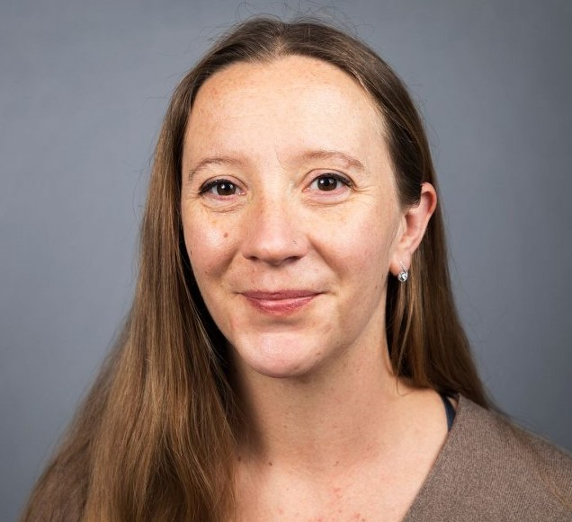

```{r setup, include=FALSE}
knitr::opts_chunk$set(echo = TRUE)
```
<style>
.column-left{
  float: left;
  width: 50%;
  text-align: left;
}
}
.column-right{
  float: right;
  width: 50%;
  text-align: left;
}
</style>


<div class="column-left">
## Michelle Greene, PhD  
Assist. Prof. of Neuroscience  
Bates College  
Lewiston, ME  
Email: mgreene@bates.edu  
**[The Greene Lab](http://michellegreene.org/index.html)**  
</div>
<div class="column-right">

</div>
\
\

## Mark Lescroart, PhD  
Department of Psychology  
University of Nevada, Reno  
Reno, NV  
Email: mlescroart@unr.edu  
**[Pieces of Mind Lab](http://piecesofmind.psyc.unr.edu/)**  
\
\

## Paul MacNeilage, PhD  
Department of Psychology  
University of Nevada, Reno  
Reno, NV  
Email: pmacneilage@unr.edu  
**[MacNeilage website](https://www.unr.edu/neuroscience/people/paul-macneilage)**  
\
\

## Benjamin Balas, PhD  
Department of Psychology  
North Dakota State University  
Fargo, ND  
Email: benjamin.balas@ndsu.edu  
**[The Balas Lab](https://sites.google.com/site/benjaminbalas/)**  
\
\

## Postdoctoral Researchers
#### Kamran Binaee, PhD

\
\

## Graduate Students
<style>
.column-l{
  float: left;
  width: 33%;
  text-align: left;
}
.column-c{
  display: inline-block;
  width: 33%;
  text-align: left;
}
.column-r{
  float: right;
  width: 33%;
  text-align: left;
}
</style>


<div class="column-l">
#### Arnab Biswas
*Picture*  
*Institution*   
arnab.biswas93@gmail.com  
\

#### Christian Sinnott  
*Picture*  
University of Nevada, Reno  
csinnott@nevada.unr.edu  
</div>
<div class="column-c">
#### Peter Hausamann  
*Picture*  
University of Nevada, Reno    
peter.hausamann@tum.de    
</div>
<div class="column-r">
#### Matthew Shinkle  
*Picture*  
University of Nevada, Reno    
mshinkle1040@gmail.com    
</div>
\
\
\
\
\
\


<style>
.column-left{
  float: left;
  width: 50%;
  text-align: left;
}
}
.column-right{
  float: right;
  width: 50%;
  text-align: left;
}
</style>
\
\

<div class="column-left">
## Administrative Contact  
Maggie Diamond-Stanic, PhD  
Program in Neuroscience
Bates College  
Lewiston, ME  
Email: mdiamond@bates.edu  
</div>
<div class="column-right2">

</div>

